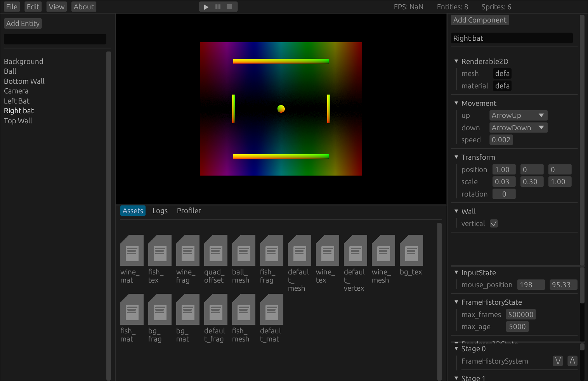

# Iridium Engine

This was a 2D game engine written in Rust for my A Level Computer Science project.

# Features

- A complete data-driven Entity Component System
- Scene editor with Unity-like entity inspector
- Procedurally generated UI for user-made components
- An in-editor play mode
- Saving and loading with automatic serialization and deserialization of user-made components
